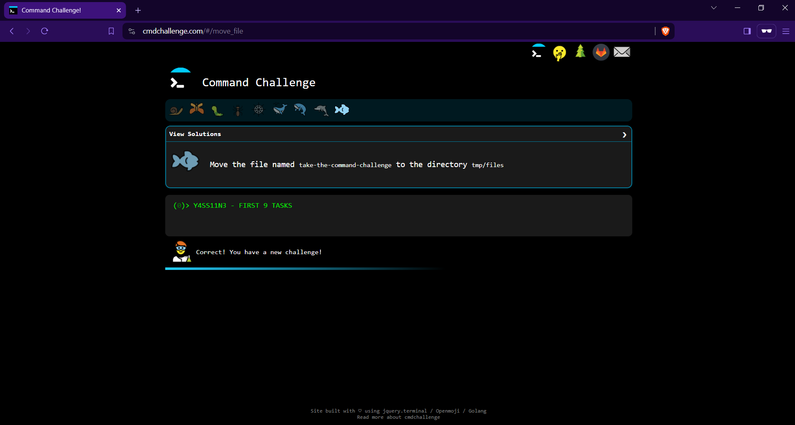
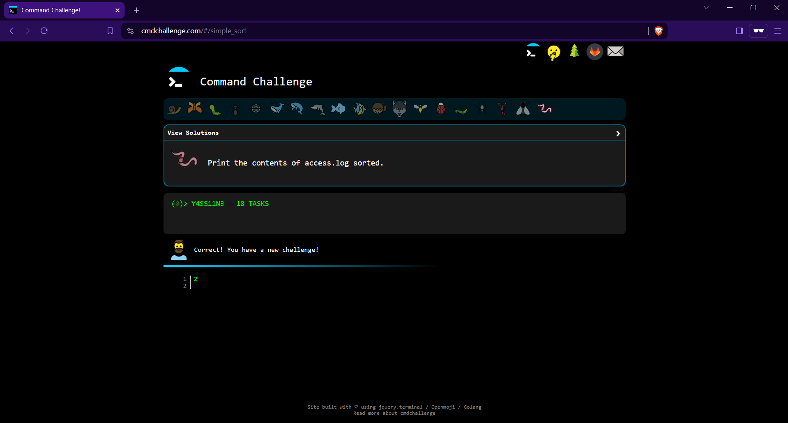
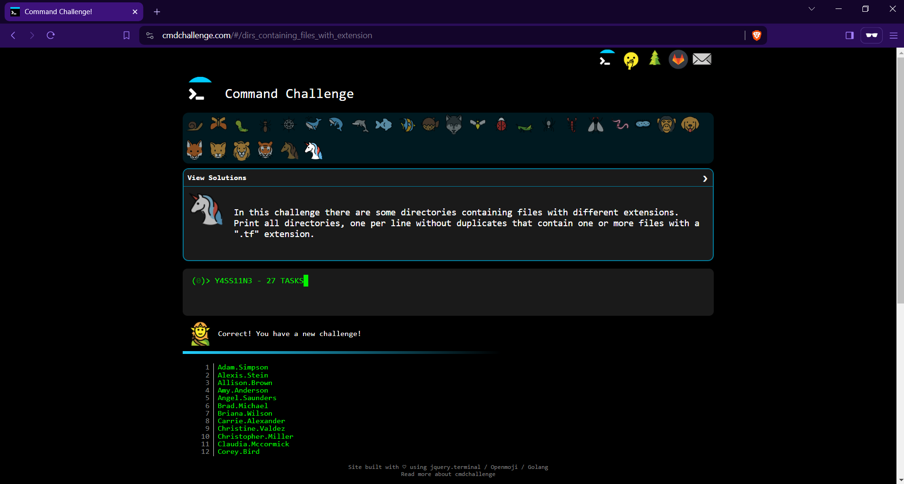

# Command Line for the Win

## Overview

This project showcases my proficiency in using the command line, as demonstrated by completing various tasks on CMD CHALLENGE. The CMD CHALLENGE is an interactive game designed to test and enhance one's Bash skills through a series of increasingly complex command line tasks.

## Requirements

### General

- Complete the specified levels in CMD CHALLENGE.
- Take screenshots showing the completion of these levels.
- Use the SFTP command-line tool to transfer these screenshots from the local machine to the sandbox environment.
- Push the screenshots to GitHub in either PNG or JPEG format.

### Specific

The project requires not only task completion but also a demonstration of file transfer skills using SFTP (Secure File Transfer Protocol). It's essential to understand how to connect to a remote server, navigate its file system, and securely transfer files.

## Completed Tasks

### Task 0: First 9 Tasks

- **Description**: Complete the first 9 tasks.
- **Screenshot**: 

### Task 1: Reach 18 Completed Tasks

- **Description**: Complete the next 9 tasks, reaching a total of 18.
- **Screenshot**: 

### Task 2: Reach the Perfect Cube, 27

- **Description**: Complete the next 9 tasks, reaching a total of 27.
- **Screenshot**: 

## Using SFTP to Transfer Files

Here's a brief guide on how I used SFTP to transfer my screenshots to the sandbox environment:

1. **Open a Terminal**: On your local machine, open a terminal or command prompt.
2. **Establish an SFTP Connection**: Connect to the sandbox environment using the provided hostname, username, and password.
   ```
   sftp username@sandbox_hostname
   ```
3. **Navigate to the Upload Directory**: Change to the directory where you wish to upload the screenshots.
   ```
   cd directory
   ```
4. **Upload the Screenshots**: Use the `put` command to upload each screenshot.
   ```
   put local_screenshot.png
   ```
5. **Verify the Transfer**: Ensure the screenshots are correctly uploaded by listing the files in the sandbox directory.
   ```
   ls
   ```
6. **Exit SFTP**: Close the SFTP session.
   ```
   exit
   ```

## AUTHORS
- Yassine Mtejjal
